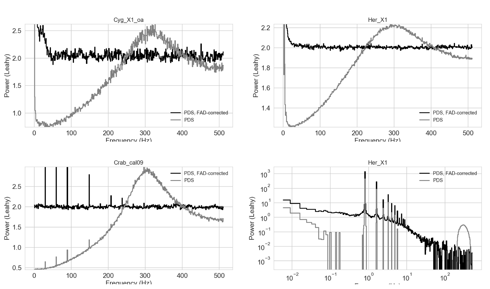

# No time for dead time: Use the Fourier amplitude differences to normalize dead time-affected periodograms

This repository contains the LaTeX source of the paper submitted to ApJL, a basic Python implementation of the FAD correction and some support material in form of Jupyter notebooks (that reproduce all plots in the paper). 

arXiv link to the paper:
https://arxiv.org/abs/1709.09700

